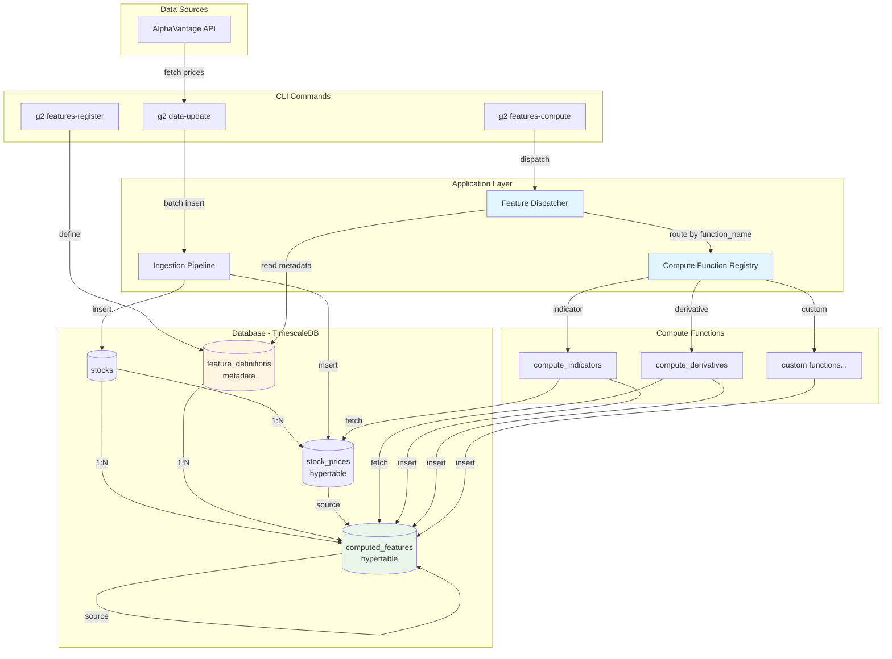

# g2 (working title)

New Python/Postgres project inspired by `folly` (technical analysis + calc_store pattern) and `gefjon` (modern ingestion/ML pipeline). The goal is to grow this incrementally with strict TDD and a running dev journal so work can be paused/resumed easily.

## Architecture



### Key Concepts

- **Metadata-Driven**: Features are defined as data in `feature_definitions`, not code
- **Registry Pattern**: Compute functions register by name (e.g., "indicator", "derivative")
- **Generic Dispatcher**: Routes computation based on `function_name` in feature definitions
- **Hypertables**: TimescaleDB optimizes time-series queries on `stock_prices` and `computed_features`
- **Pure Functions**: Compute functions are side-effect-free, dispatcher handles DB I/O

## Current focus
- Capture initial domain notes (data model, sources/computed separation, calc_store-style descriptors)
- Set up a minimal Python package + pytest harness
- Keep AlphaVantage credentials in `.env` (reused from `../gefjon/.env`, never printed or committed)

## Running tests
```bash
python -m pytest -q
```

### Make targets
- `make venv` — create/upgrade the venv and install dev deps
- `make test` — run pytest in the venv (DB tests skipped)
- `make test-db` — run pytest with `ENABLE_DB_TESTS=1` (requires running Postgres)
- `make db-up` / `make db-down` — start/stop TimescaleDB via docker compose
- `make db-health` — pg_isready check against the running container

## CLI
- Install (editable): `pip install -e .`
- Run: `g2 ingest-prices --symbol IBM --input tests/fixtures/demo_time_series_daily_adjusted.json`
  - Uses `DATABASE_URL` from env; creates tables if missing.
- Universe ingest (AlphaVantage LISTING_STATUS + prices):
  - `g2 ingest-universe --exchange NASDAQ --limit 5 --max-workers 4 --timeframe auto --update-existing`
  - Respects `ALPHAVANTAGE_API_KEY` and `calls_per_minute` (default 75 for premium). `timeframe auto` chooses full if no data or newest point is older than ~100 days; otherwise compact. `--update-existing` upserts existing dates.
  - CLI loads `.env` automatically for `ALPHAVANTAGE_API_KEY` and `DATABASE_URL`.
- Indicators ingest:
  - `g2 ingest-indicators --exchange NASDAQ --local --indicators rsi,macd,bbands,adx,stoch,psar --refresh`
  - Local mode (default) computes indicators from existing `stock_prices` and resumes from the last indicator date; use `--api` to fetch from AlphaVantage instead. Writer/fetch workers are auto-sized; progress shows mode and queue/fetch stats.

## Local Postgres (TimescaleDB)
- Copy `.env.example` to `.env` and adjust credentials as needed.
- Start database: `docker compose up -d postgres`
- A TimescaleDB extension is enabled via `docker/initdb.d/timescaledb.sql`.
- **Initialize schema**: `psql -d g2 -f sql/schema.sql`
  - Creates all tables, hypertables, and indexes
  - Safe to run multiple times (idempotent)

## Contributing workflow (TDD-first)
- Write a failing test that describes the behavior
- Implement the smallest change to make it pass
- Refactor with tests green
- Update docs/dev-journal.md with what changed and why
