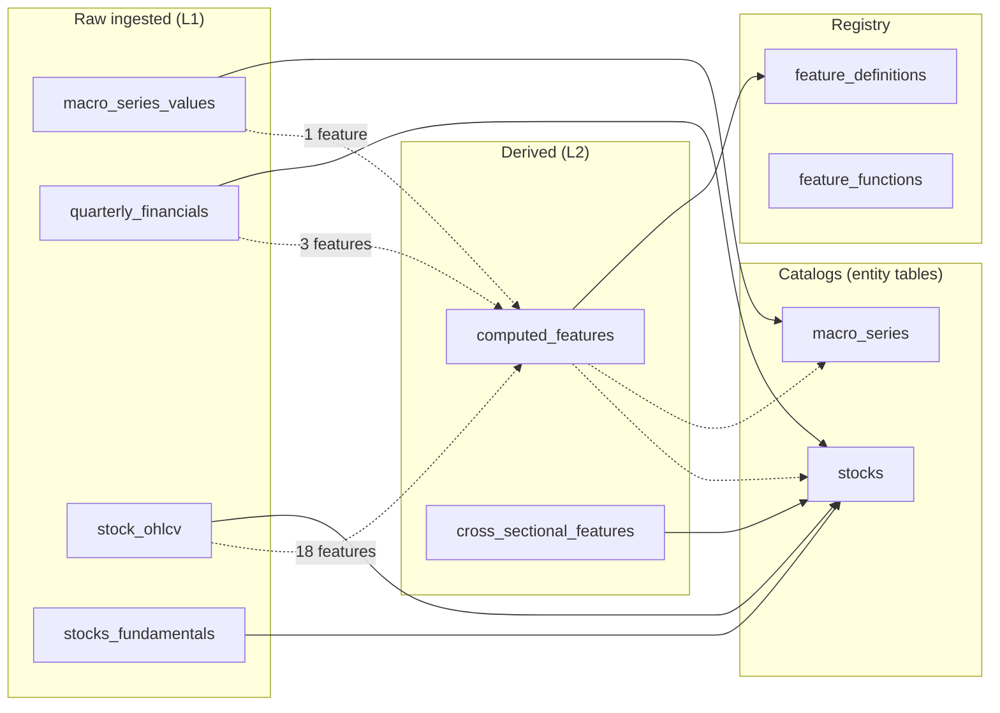

# Gefion Data Dictionary

*Generated by `scripts/gen_data_dictionary.py` from `sql/schema.sql`, `sql/migrations/*.sql`, and `src/gefion/alphavantage/catalog.py`. Do not edit by hand — re-run the script and commit the diff.*

## Contents

- [Tables](#tables)
  - [`computed_features`](#computed-features)
  - [`cross_sectional_features`](#cross-sectional-features)
  - [`discovery_diagnostics`](#discovery-diagnostics)
  - [`experiment_cycles`](#experiment-cycles)
  - [`experiment_trials`](#experiment-trials)
  - [`experiments`](#experiments)
  - [`feature_definitions`](#feature-definitions)
  - [`feature_functions`](#feature-functions)
  - [`macro_series`](#macro-series)
  - [`macro_series_values`](#macro-series-values)
  - [`ml_datasets`](#ml-datasets)
  - [`ml_models`](#ml-models)
  - [`ml_runs`](#ml-runs)
  - [`model_performance`](#model-performance)
  - [`prediction_outcomes`](#prediction-outcomes)
  - [`predictions`](#predictions)
  - [`quarterly_financials`](#quarterly-financials)
  - [`regime_candidates`](#regime-candidates)
  - [`regime_definitions`](#regime-definitions)
  - [`regime_discovery_runs`](#regime-discovery-runs)
  - [`regime_labels`](#regime-labels)
  - [`regime_trust_grades`](#regime-trust-grades)
  - [`schema_migrations`](#schema-migrations)
  - [`stock_ohlcv`](#stock-ohlcv)
  - [`stocks`](#stocks)
  - [`stocks_fundamentals`](#stocks-fundamentals)
  - [`strategy_configs`](#strategy-configs)
  - [`strategy_registry`](#strategy-registry)
  - [`volatility_thresholds`](#volatility-thresholds)
- [Feeds graph](#feeds-graph-what-feeds-what)
- [AlphaVantage endpoints → tables](#alphavantage-endpoints--tables)

## Tables

### `computed_features`

Computed feature values. TimescaleDB hypertable keyed by (data_id, feature_id, date). Tall format.

**TimescaleDB hypertable** · Primary key: `data_id, date, feature_id`

| Column | Type | Null | Source | Notes |
|---|---|---|---|---|
| **`data_id`** 🔑 | INTEGER |  |  |  |
| **`date`** 🔑 | DATE |  |  |  |
| **`feature_id`** 🔑 | INTEGER |  |  |  |
| `value` | DOUBLE PRECISION | ✓ |  |  |
| `source` | TEXT | ✓ |  |  |
| `created_at` | TIMESTAMP | ✓ |  |  |

### `cross_sectional_features`

Market-relative feature rankings (percentile, z-score) computed across the universe per date.

**TimescaleDB hypertable** · Primary key: `comparison_group, data_id, date, feature_name`

| Column | Type | Null | Source | Notes |
|---|---|---|---|---|
| **`data_id`** 🔑 | INTEGER |  |  |  |
| **`date`** 🔑 | DATE |  |  |  |
| **`feature_name`** 🔑 | TEXT |  |  |  |
| `value` | DOUBLE PRECISION | ✓ |  |  |
| `rank` | INTEGER | ✓ |  |  |
| `percentile` | DOUBLE PRECISION | ✓ |  |  |
| `created_at` | TIMESTAMP | ✓ |  |  |
| **`comparison_group`** 🔑 | TEXT |  |  |  |

### `discovery_diagnostics`

*(no description yet)*

Primary key: `id`

| Column | Type | Null | Source | Notes |
|---|---|---|---|---|
| **`id`** 🔑 | SERIAL |  |  |  |
| `run_id` | INTEGER |  |  |  |
| `kind` | TEXT |  |  |  |
| `detail` | JSONB |  |  |  |
| `sample_dependent` | BOOLEAN |  |  |  |
| `dataset_version` | TEXT |  |  |  |
| `created_at` | TIMESTAMPTZ |  |  |  |

### `experiment_cycles`

Top-level autonomous experiment cycles (discover → propose → run → evaluate).

Primary key: `id`

| Column | Type | Null | Source | Notes |
|---|---|---|---|---|
| **`id`** 🔑 | SERIAL |  |  |  |
| `name` | TEXT |  |  |  |
| `holdout_start_date` | DATE |  |  |  |
| `holdout_end_date` | DATE |  |  |  |
| `fdr_rate` | NUMERIC | ✓ |  |  |
| `discovery_snapshot` | JSONB | ✓ |  |  |
| `principles_consulted` | JSONB | ✓ |  |  |
| `status` | TEXT | ✓ |  |  |
| `compute_budget_seconds` | INTEGER | ✓ |  |  |
| `max_experiments` | INTEGER | ✓ |  |  |
| `created_at` | TIMESTAMPTZ | ✓ |  |  |
| `completed_at` | TIMESTAMPTZ | ✓ |  |  |
| `summary` | JSONB | ✓ |  |  |

### `experiment_trials`

Individual trials within an experiment (e.g. one hyperparameter combination).

Primary key: `id`

| Column | Type | Null | Source | Notes |
|---|---|---|---|---|
| **`id`** 🔑 | SERIAL |  |  |  |
| `experiment_id` | INTEGER |  |  |  |
| `trial_number` | INTEGER |  |  |  |
| `params` | JSONB |  |  |  |
| `metrics` | JSONB |  |  |  |
| `score` | NUMERIC(12,6) | ✓ |  |  |
| `started_at` | TIMESTAMP | ✓ |  |  |
| `completed_at` | TIMESTAMP | ✓ |  |  |
| `duration_seconds` | NUMERIC(10,2) | ✓ |  |  |

### `experiments`

Autonomous experimentation framework: proposed/approved/run experiments.

Primary key: `id`

| Column | Type | Null | Source | Notes |
|---|---|---|---|---|
| **`id`** 🔑 | SERIAL |  |  |  |
| `name` | VARCHAR(255) |  |  |  |
| `experiment_type` | VARCHAR(50) |  |  |  |
| `config` | JSONB |  |  |  |
| `search_space` | JSONB | ✓ |  |  |
| `objective_metric` | VARCHAR(50) | ✓ |  |  |
| `objective_direction` | VARCHAR(10) | ✓ |  |  |
| `goal_target` | NUMERIC(12,6) | ✓ |  |  |
| `goal_type` | VARCHAR(20) | ✓ |  |  |
| `baseline_value` | NUMERIC(12,6) | ✓ |  |  |
| `early_stop_on_goal` | BOOLEAN | ✓ |  |  |
| `status` | VARCHAR(20) | ✓ |  |  |
| `priority` | INTEGER | ✓ |  |  |
| `parent_experiment_id` | INTEGER | ✓ |  |  |
| `depends_on_output` | VARCHAR(100) | ✓ |  |  |
| `results` | JSONB | ✓ |  |  |
| `artifacts_path` | VARCHAR(500) | ✓ |  |  |
| `goal_achieved` | BOOLEAN | ✓ |  |  |
| `proposed_by` | VARCHAR(50) | ✓ |  |  |
| `approved_by` | VARCHAR(50) | ✓ |  |  |
| `created_at` | TIMESTAMP | ✓ |  |  |
| `started_at` | TIMESTAMP | ✓ |  |  |
| `completed_at` | TIMESTAMP | ✓ |  |  |
| `total_trials` | INTEGER | ✓ |  |  |
| `completed_trials` | INTEGER | ✓ |  |  |
| `best_score` | NUMERIC(12,6) | ✓ |  |  |
| `cycle_id` | INTEGER | ✓ |  |  |
| `principle_id` | TEXT | ✓ |  |  |
| `null_hypothesis` | TEXT | ✓ |  |  |
| `holdout_p_value` | NUMERIC | ✓ |  |  |
| `fdr_survived` | BOOLEAN | ✓ |  |  |
| `discovery_context` | JSONB | ✓ |  |  |
| `risk_level` | TEXT | ✓ |  |  |
| `resource_usage` | JSONB | ✓ |  |  |
| `promoted_at` | TIMESTAMPTZ | ✓ |  |  |
| `demoted_at` | TIMESTAMPTZ | ✓ |  |  |
| `probation_until` | TIMESTAMPTZ | ✓ |  |  |

### `feature_definitions`

Configuration: what feature to compute, with what params, from what source table/column.

Primary key: `id`

| Column | Type | Null | Source | Notes |
|---|---|---|---|---|
| **`id`** 🔑 | SERIAL |  |  |  |
| `name` | TEXT |  |  |  |
| `function_name` | TEXT |  |  |  |
| `params` | JSONB | ✓ |  |  |
| `source_table` | TEXT | ✓ |  |  |
| `source_column` | TEXT | ✓ |  |  |
| `store_table` | TEXT | ✓ |  |  |
| `store_column` | TEXT | ✓ |  |  |
| `store_type` | TEXT | ✓ |  |  |
| `active` | BOOLEAN | ✓ |  |  |
| `version` | TEXT | ✓ |  |  |
| `created_at` | TIMESTAMP | ✓ |  |  |
| `entity_table` | TEXT |  |  |  |
| `is_experimental` | BOOLEAN | ✓ |  |  |
| `source_experiment_id` | INTEGER | ✓ |  |  |
| `promoted_at` | TIMESTAMPTZ | ✓ |  |  |
| `source_tables` | JSONB | ✓ |  |  |
| `source_columns` | JSONB | ✓ |  |  |

### `feature_functions`

Sandboxed Python function bodies that implement features. Versioned, enable/disable-able.

Primary key: `id`

| Column | Type | Null | Source | Notes |
|---|---|---|---|---|
| **`id`** 🔑 | SERIAL |  |  |  |
| `name` | TEXT |  |  |  |
| `version` | TEXT |  |  |  |
| `status` | TEXT | ✓ |  |  |
| `description` | TEXT | ✓ |  |  |
| `language` | TEXT |  |  |  |
| `function_body` | TEXT |  |  |  |
| `inputs` | JSONB | ✓ |  |  |
| `output_name` | TEXT | ✓ |  |  |
| `output_type` | TEXT | ✓ |  |  |
| `param_schema` | JSONB | ✓ |  |  |
| `defaults` | JSONB | ✓ |  |  |
| `dependencies` | JSONB | ✓ |  |  |
| `checksum` | TEXT | ✓ |  |  |
| `tags` | TEXT[] | ✓ |  |  |
| `min_app_version` | TEXT | ✓ |  |  |
| `enabled` | BOOLEAN | ✓ |  |  |
| `created_by` | TEXT | ✓ |  |  |
| `called_by` | TEXT | ✓ |  |  |
| `created_at` | TIMESTAMP | ✓ |  |  |
| `updated_at` | TIMESTAMP | ✓ |  |  |

### `macro_series`

Macro-series catalog (VIX, CPI, rates …). One row per market-level series — the first non-stock entity table (spec 007). Rows are configuration: a new series is an INSERT, never DDL.

Primary key: `id`

| Column | Type | Null | Source | Notes |
|---|---|---|---|---|
| **`id`** 🔑 | SERIAL |  |  |  |
| `name` | TEXT |  |  |  |
| `provider` | TEXT |  |  |  |
| `kind` | TEXT |  |  |  |
| `cadence` | TEXT |  |  |  |
| `description` | TEXT | ✓ |  |  |
| `created_at` | TIMESTAMPTZ |  |  |  |

### `macro_series_values`

Raw macro-series values keyed by (series_id, date). Required `value` + optional OHLC serves daily-OHLC and monthly-single-value series alike. Plain relational, not a hypertable.

Primary key: `date, series_id`

| Column | Type | Null | Source | Notes |
|---|---|---|---|---|
| **`series_id`** 🔑 | INTEGER |  |  |  |
| **`date`** 🔑 | DATE |  |  |  |
| `value` | NUMERIC(14,6) |  |  |  |
| `open` | NUMERIC(14,6) | ✓ |  |  |
| `high` | NUMERIC(14,6) | ✓ |  |  |
| `low` | NUMERIC(14,6) | ✓ |  |  |

### `ml_datasets`

Dataset manifests: which symbols + features + time range used for an ML run.

Primary key: `id`

| Column | Type | Null | Source | Notes |
|---|---|---|---|---|
| **`id`** 🔑 | SERIAL |  |  |  |
| `name` | TEXT |  |  |  |
| `version` | TEXT |  |  |  |
| `created_at` | TIMESTAMP | ✓ |  |  |
| `universe` | JSONB | ✓ |  |  |
| `feature_names` | TEXT[] |  |  |  |
| `lookback_days` | INTEGER |  |  |  |
| `horizons_days` | INTEGER[] |  |  |  |
| `label_spec` | JSONB |  |  |  |
| `split_spec` | JSONB |  |  |  |
| `artifact_uri` | TEXT |  |  |  |
| `checksum` | TEXT | ✓ |  |  |

### `ml_models`

Trained model metadata. Points at file artifacts on disk.

Primary key: `id`

| Column | Type | Null | Source | Notes |
|---|---|---|---|---|
| **`id`** 🔑 | SERIAL |  |  |  |
| `name` | TEXT |  |  |  |
| `version` | TEXT |  |  |  |
| `created_at` | TIMESTAMP | ✓ |  |  |
| `train_run_id` | INTEGER | ✓ |  |  |
| `dataset_id` | INTEGER | ✓ |  |  |
| `algorithm` | TEXT | ✓ |  |  |
| `hyperparams` | JSONB | ✓ |  |  |
| `metrics` | JSONB | ✓ |  |  |
| `artifact_uri` | TEXT |  |  |  |
| `active` | BOOLEAN | ✓ |  |  |

### `ml_runs`

Training run history with hyperparameters, dataset reference, metrics.

Primary key: `id`

| Column | Type | Null | Source | Notes |
|---|---|---|---|---|
| **`id`** 🔑 | SERIAL |  |  |  |
| `run_type` | TEXT |  |  |  |
| `status` | TEXT |  |  |  |
| `created_at` | TIMESTAMP | ✓ |  |  |
| `started_at` | TIMESTAMP | ✓ |  |  |
| `finished_at` | TIMESTAMP | ✓ |  |  |
| `dataset_id` | INTEGER | ✓ |  |  |
| `run_config` | JSONB |  |  |  |
| `code_version` | TEXT | ✓ |  |  |
| `notes` | TEXT | ✓ |  |  |

### `model_performance`

Aggregated model evaluation metrics (coverage, pinball loss) per evaluation window.

Primary key: `horizon_days, model_id`

| Column | Type | Null | Source | Notes |
|---|---|---|---|---|
| **`model_id`** 🔑 | INTEGER |  |  |  |
| `model_name` | TEXT |  |  |  |
| **`horizon_days`** 🔑 | INTEGER |  |  |  |
| `q10_calibration` | NUMERIC(5,2) | ✓ |  |  |
| `q50_calibration` | NUMERIC(5,2) | ✓ |  |  |
| `q90_calibration` | NUMERIC(5,2) | ✓ |  |  |
| `quantile_loss` | NUMERIC(10,6) | ✓ |  |  |
| `avg_iqr` | NUMERIC(10,4) | ✓ |  |  |
| `eval_start_date` | DATE | ✓ |  |  |
| `eval_end_date` | DATE | ✓ |  |  |
| `num_predictions` | INTEGER | ✓ |  |  |
| `updated_at` | TIMESTAMP | ✓ |  |  |
| `eval_run_id` | INTEGER | ✓ |  |  |

### `prediction_outcomes`

Realized returns paired with predictions, used for evaluation.

**TimescaleDB hypertable** · Primary key: `data_id, horizon_days, prediction_date`

| Column | Type | Null | Source | Notes |
|---|---|---|---|---|
| **`data_id`** 🔑 | INTEGER |  |  |  |
| **`prediction_date`** 🔑 | DATE |  |  |  |
| `outcome_date` | DATE |  |  |  |
| **`horizon_days`** 🔑 | INTEGER |  |  |  |
| `actual_return` | NUMERIC(10,4) | ✓ |  |  |
| `model_id` | INTEGER | ✓ |  |  |
| `created_at` | TIMESTAMP | ✓ |  |  |
| `run_id` | INTEGER | ✓ |  |  |

### `predictions`

Model outputs. Quantile (q10/q50/q90) and trend-class predictions stored in JSONB.

**TimescaleDB hypertable** · Primary key: `data_id, horizon_days, model_id, prediction_date, prediction_type`

| Column | Type | Null | Source | Notes |
|---|---|---|---|---|
| **`model_id`** 🔑 | INTEGER |  |  |  |
| **`data_id`** 🔑 | INTEGER |  |  |  |
| **`prediction_date`** 🔑 | DATE |  |  |  |
| **`horizon_days`** 🔑 | INTEGER |  |  |  |
| **`prediction_type`** 🔑 | TEXT |  |  |  |
| `prediction_values` | JSONB |  |  |  |
| `metadata` | JSONB | ✓ |  |  |
| `run_id` | INTEGER | ✓ |  |  |
| `created_at` | TIMESTAMP | ✓ |  |  |

### `quarterly_financials`

Quarterly financial statements (income, balance sheet, cash flow, earnings). One row per (symbol, fiscal_date, statement_type). Non-core fields in `raw` JSONB.

**TimescaleDB hypertable** · Primary key: `data_id, date, statement_type`

| Column | Type | Null | Source | Notes |
|---|---|---|---|---|
| **`data_id`** 🔑 | INTEGER |  |  |  |
| **`date`** 🔑 | DATE |  |  |  |
| **`statement_type`** 🔑 | TEXT |  |  |  |
| `reported_at` | DATE | ✓ |  |  |
| `revenue` | BIGINT | ✓ | `INCOME_STATEMENT`. `totalRevenue` | Total revenue for the quarter |
| `net_income` | BIGINT | ✓ | `INCOME_STATEMENT`. `netIncome` | Net income |
| `gross_profit` | BIGINT | ✓ | `INCOME_STATEMENT`. `grossProfit` | Gross profit |
| `ebitda` | BIGINT | ✓ | `INCOME_STATEMENT`. `ebitda` | EBITDA |
| `operating_income` | BIGINT | ✓ | `INCOME_STATEMENT`. `operatingIncome` | Operating income |
| `eps` | NUMERIC(10,4) | ✓ | `INCOME_STATEMENT`. `eps` | Earnings per share (basic) |
| `total_assets` | BIGINT | ✓ | `BALANCE_SHEET`. `totalAssets` | Total assets |
| `total_liabilities` | BIGINT | ✓ | `BALANCE_SHEET`. `totalLiabilities` | Total liabilities |
| `shareholder_equity` | BIGINT | ✓ | `BALANCE_SHEET`. `totalShareholderEquity` | Shareholder equity |
| `current_assets` | BIGINT | ✓ | `BALANCE_SHEET`. `totalCurrentAssets` | Current assets |
| `current_liabilities` | BIGINT | ✓ | `BALANCE_SHEET`. `totalCurrentLiabilities` | Current liabilities |
| `long_term_debt` | BIGINT | ✓ | `BALANCE_SHEET`. `longTermDebt` | Long-term debt |
| `shares_outstanding` | BIGINT | ✓ | `BALANCE_SHEET`. `commonStockSharesOutstanding` | Shares outstanding at quarter end |
| `operating_cashflow` | BIGINT | ✓ | `CASH_FLOW`. `operatingCashflow` | Operating cash flow |
| `capital_expenditures` | BIGINT | ✓ | `CASH_FLOW`. `capitalExpenditures` | Capital expenditures (CapEx) |
| `free_cash_flow` | BIGINT | ✓ |  |  |
| `reported_eps` | NUMERIC(10,4) | ✓ | `EARNINGS`. `reportedEPS` | Actual reported EPS |
| `estimated_eps` | NUMERIC(10,4) | ✓ | `EARNINGS`. `estimatedEPS` | Analyst consensus EPS estimate |
| `surprise` | NUMERIC(10,4) | ✓ | `EARNINGS`. `surprise` | Reported − estimated |
| `surprise_percentage` | NUMERIC(10,4) | ✓ | `EARNINGS`. `surprisePercentage` | Surprise as % of estimate |
| `raw` | JSONB | ✓ |  |  |
| `created_at` | TIMESTAMP | ✓ |  |  |

### `regime_candidates`

*(no description yet)*

Primary key: `id`

| Column | Type | Null | Source | Notes |
|---|---|---|---|---|
| **`id`** 🔑 | SERIAL |  |  |  |
| `run_id` | INTEGER |  |  |  |
| `candidate_hash` | TEXT |  |  |  |
| `expression` | JSONB |  |  |  |
| `tier` | TEXT |  |  |  |
| `provenance` | JSONB | ✓ |  |  |
| `results` | JSONB | ✓ |  |  |
| `counted_in_family` | BOOLEAN |  |  |  |
| `verdict` | TEXT | ✓ |  |  |

### `regime_definitions`

*(no description yet)*

Primary key: `id`

| Column | Type | Null | Source | Notes |
|---|---|---|---|---|
| **`id`** 🔑 | SERIAL |  |  |  |
| `name` | TEXT |  |  |  |
| `scope` | TEXT |  |  |  |
| `expression` | JSONB |  |  |  |
| `bucketing` | JSONB |  |  |  |
| `persistence` | JSONB | ✓ |  |  |
| `origin` | TEXT |  |  |  |
| `descriptive_metadata` | JSONB | ✓ |  |  |
| `status` | TEXT |  |  |  |
| `created_at` | TIMESTAMPTZ |  |  |  |

### `regime_discovery_runs`

*(no description yet)*

Primary key: `id`

| Column | Type | Null | Source | Notes |
|---|---|---|---|---|
| **`id`** 🔑 | SERIAL |  |  |  |
| `name` | TEXT |  |  |  |
| `seed` | BIGINT |  |  |  |
| `search_space` | JSONB |  |  |  |
| `segregation` | JSONB |  |  |  |
| `reserve_consumed` | BOOLEAN |  |  |  |
| `family_size` | INTEGER | ✓ |  |  |
| `status` | TEXT |  |  |  |
| `dataset_version` | TEXT |  |  |  |
| `created_at` | TIMESTAMPTZ |  |  |  |
| `completed_at` | TIMESTAMPTZ | ✓ |  |  |

### `regime_labels`

*(no description yet)*

**TimescaleDB hypertable** · Primary key: `date, entity_id, regime_id`

| Column | Type | Null | Source | Notes |
|---|---|---|---|---|
| **`regime_id`** 🔑 | INTEGER |  |  |  |
| **`date`** 🔑 | DATE |  |  |  |
| **`entity_id`** 🔑 | INTEGER |  |  |  |
| `label` | TEXT |  |  |  |
| `dataset_version` | TEXT |  |  |  |

### `regime_trust_grades`

*(no description yet)*

Primary key: `id`

| Column | Type | Null | Source | Notes |
|---|---|---|---|---|
| **`id`** 🔑 | SERIAL |  |  |  |
| `candidate_id` | INTEGER |  |  |  |
| `fold` | INTEGER |  |  |  |
| `confirmed` | BOOLEAN |  |  |  |
| `descriptive` | BOOLEAN |  |  |  |
| `detail` | JSONB | ✓ |  |  |
| `graded_at` | TIMESTAMPTZ |  |  |  |

### `schema_migrations`

Migration bookkeeping: which sql/migrations/*.sql files have been applied (managed by `src/gefion/db/migrate.py`).

Primary key: `id`

| Column | Type | Null | Source | Notes |
|---|---|---|---|---|
| **`id`** 🔑 | SERIAL |  |  |  |
| `version` | TEXT |  |  |  |
| `name` | TEXT |  |  |  |
| `applied_at` | TIMESTAMP | ✓ |  |  |
| `checksum` | TEXT | ✓ |  |  |

### `stock_ohlcv`

Daily OHLCV price data. TimescaleDB hypertable, the foundation every feature and model is built on.

**TimescaleDB hypertable** · Primary key: `date, id`

| Column | Type | Null | Source | Notes |
|---|---|---|---|---|
| **`id`** 🔑 | BIGSERIAL |  |  |  |
| `data_id` | INTEGER |  |  |  |
| **`date`** 🔑 | DATE |  |  |  |
| `open` | NUMERIC(18,6) | ✓ | `TIME_SERIES_DAILY_ADJUSTED`. `1. open` | Opening price |
| `high` | NUMERIC(18,6) | ✓ | `TIME_SERIES_DAILY_ADJUSTED`. `2. high` | Daily high |
| `low` | NUMERIC(18,6) | ✓ | `TIME_SERIES_DAILY_ADJUSTED`. `3. low` | Daily low |
| `close` | NUMERIC(18,6) | ✓ | `TIME_SERIES_DAILY_ADJUSTED`. `4. close` | Closing price |
| `adjusted_close` | NUMERIC(18,6) | ✓ | `TIME_SERIES_DAILY_ADJUSTED`. `5. adjusted close` | Split/dividend-adjusted close |
| `dividend_amount` | NUMERIC(18,6) | ✓ | `TIME_SERIES_DAILY_ADJUSTED`. `7. dividend amount` | Cash dividend per share on date |
| `split_coefficient` | NUMERIC(18,6) | ✓ | `TIME_SERIES_DAILY_ADJUSTED`. `8. split coefficient` | Split ratio (1.0 = no split) |
| `volume` | BIGINT | ✓ | `TIME_SERIES_DAILY_ADJUSTED`. `6. volume` | Share volume |
| `source` | TEXT | ✓ |  |  |

### `stocks`

Universe membership. One row per symbol, with listing metadata.

Primary key: `id`

| Column | Type | Null | Source | Notes |
|---|---|---|---|---|
| **`id`** 🔑 | SERIAL |  |  |  |
| `symbol` | TEXT |  | `LISTING_STATUS`. `symbol` | Stock ticker |
| `status` | TEXT | ✓ | `LISTING_STATUS`. `status` | active / delisted |
| `name` | TEXT | ✓ | `LISTING_STATUS`. `name` | Company name |
| `sector` | TEXT | ✓ |  |  |
| `industry` | TEXT | ✓ |  |  |
| `exchange` | TEXT | ✓ | `LISTING_STATUS`. `exchange` | Listing exchange (NASDAQ, NYSE, ...) |
| `asset_type` | TEXT | ✓ | `LISTING_STATUS`. `assetType` | Stock / ETF / etc. |
| `updated_at` | TIMESTAMP | ✓ |  |  |

### `stocks_fundamentals`

Point-in-time company fundamentals (no history — overwritten on update).

**TimescaleDB hypertable** · Primary key: `data_id, date`

| Column | Type | Null | Source | Notes |
|---|---|---|---|---|
| **`data_id`** 🔑 | INTEGER |  |  |  |
| **`date`** 🔑 | DATE |  |  |  |
| `market_cap` | BIGINT | ✓ | `OVERVIEW`. `MarketCapitalization` | Market capitalization in USD |
| `pe_ratio` | NUMERIC(10,2) | ✓ | `OVERVIEW`. `PERatio` | Trailing P/E ratio |
| `forward_pe` | NUMERIC(10,2) | ✓ | `OVERVIEW`. `ForwardPE` | Forward P/E ratio |
| `peg_ratio` | NUMERIC(10,4) | ✓ | `OVERVIEW`. `PEGRatio` | Price/Earnings-to-Growth |
| `book_value` | NUMERIC(12,4) | ✓ | `OVERVIEW`. `BookValue` | Book value per share |
| `dividend_yield` | NUMERIC(14,6) | ✓ | `OVERVIEW`. `DividendYield` | Annualized dividend yield |
| `eps` | NUMERIC(10,4) | ✓ | `OVERVIEW`. `EPS` | Earnings per share (TTM) |
| `revenue_per_share` | NUMERIC(10,4) | ✓ | `OVERVIEW`. `RevenuePerShareTTM` | Revenue per share TTM |
| `profit_margin` | NUMERIC(14,6) | ✓ | `OVERVIEW`. `ProfitMargin` | Net profit margin |
| `operating_margin` | NUMERIC(14,6) | ✓ | `OVERVIEW`. `OperatingMarginTTM` | Operating margin TTM |
| `return_on_equity` | NUMERIC(14,6) | ✓ | `OVERVIEW`. `ReturnOnEquityTTM` | Return on equity TTM |
| `beta` | NUMERIC(8,4) | ✓ | `OVERVIEW`. `Beta` | Beta vs market |
| `ev_to_ebitda` | NUMERIC(10,2) | ✓ | `OVERVIEW`. `EVToEBITDA` | Enterprise value / EBITDA |
| `shares_outstanding` | BIGINT | ✓ | `OVERVIEW`. `SharesOutstanding` | Shares outstanding |
| `created_at` | TIMESTAMP | ✓ |  |  |

### `strategy_configs`

Saved strategy parameter sets for reuse across backtests.

Primary key: `id`

| Column | Type | Null | Source | Notes |
|---|---|---|---|---|
| **`id`** 🔑 | SERIAL |  |  |  |
| `name` | TEXT |  |  |  |
| `strategy_name` | TEXT |  |  |  |
| `params` | JSONB |  |  |  |
| `description` | TEXT | ✓ |  |  |
| `active` | BOOLEAN | ✓ |  |  |
| `created_at` | TIMESTAMPTZ | ✓ |  |  |
| `updated_at` | TIMESTAMPTZ | ✓ |  |  |

### `strategy_registry`

Catalogue of available trading strategies.

Primary key: `id`

| Column | Type | Null | Source | Notes |
|---|---|---|---|---|
| **`id`** 🔑 | SERIAL |  |  |  |
| `name` | TEXT |  |  |  |
| `module_path` | TEXT |  |  |  |
| `class_name` | TEXT |  |  |  |
| `default_params` | JSONB | ✓ |  |  |
| `param_schema` | JSONB | ✓ |  |  |
| `description` | TEXT | ✓ |  |  |
| `tags` | TEXT[] | ✓ |  |  |
| `enabled` | BOOLEAN | ✓ |  |  |
| `created_at` | TIMESTAMPTZ | ✓ |  |  |

### `volatility_thresholds`

Per-symbol volatility thresholds used by trend-classifier label generation.

**TimescaleDB hypertable** · Primary key: `calculation_date, data_id, horizon_days`

| Column | Type | Null | Source | Notes |
|---|---|---|---|---|
| **`data_id`** 🔑 | INTEGER |  |  |  |
| **`horizon_days`** 🔑 | INTEGER |  |  |  |
| **`calculation_date`** 🔑 | DATE |  |  |  |
| `historical_volatility` | NUMERIC(10,6) | ✓ |  |  |
| `bb_width` | NUMERIC(10,6) | ✓ |  |  |
| `weak_threshold` | NUMERIC(10,6) | ✓ |  |  |
| `strong_threshold` | NUMERIC(10,6) | ✓ |  |  |
| `volatility_percentile` | NUMERIC(5,4) | ✓ |  |  |
| `created_at` | TIMESTAMPTZ | ✓ |  |  |

## Feeds graph (what feeds what)

*Solid edges are hard foreign keys from the SQL schema; dashed edges are declared registry edges from `feature-definitions/*.json` — `source_table` (what a feature reads) and `entity_table` (who its values belong to; spec 007). A raw table with no declared consumers is flagged: it is either dead weight or missing its feature definitions.*

### Declared consumers per raw table

| Raw table | Declared consumers |
|---|---|
| `macro_series_values` | `computed_features` (1 feature) |
| `quarterly_financials` | `computed_features` (3 features) |
| `stock_ohlcv` | `computed_features` (18 features) |
| `stocks_fundamentals` | ⚠️ **none — no declared consumers** |

## AlphaVantage endpoints → tables

Each entry below comes from `ENDPOINT_DOCS` in `src/gefion/alphavantage/catalog.py`. **Every new endpoint that lands data in our DB must add an entry there** so the data dictionary stays accurate.

| Endpoint | Cadence | Tables | CLI |
|---|---|---|---|
| `BALANCE_SHEET` | quarterly (gefion financials-backfill) | `quarterly_financials` | gefion financials-backfill |
| `CASH_FLOW` | quarterly (gefion financials-backfill) | `quarterly_financials` | gefion financials-backfill |
| `CPI` | monthly | *(none yet)* | (not yet wired up) |
| `EARNINGS` | quarterly (gefion financials-backfill) | `quarterly_financials` | gefion financials-backfill |
| `INCOME_STATEMENT` | quarterly (gefion financials-backfill) | `quarterly_financials` | gefion financials-backfill |
| `LISTING_STATUS` | weekly | `stocks` | (implicit, universe management) |
| `OVERVIEW` | on-demand (gefion fundamentals-update) | `stocks_fundamentals` | gefion fundamentals-update |
| `TIME_SERIES_DAILY_ADJUSTED` | daily | `stock_ohlcv` | gefion data-update / gefion prices-ingest |

### `BALANCE_SHEET`

> statement_type = 'balance_sheet'. Non-core fields preserved in `raw` JSONB column.

| AlphaVantage field | Lands in | Description |
|---|---|---|
| `totalAssets` | `quarterly_financials`.`total_assets` | Total assets |
| `totalLiabilities` | `quarterly_financials`.`total_liabilities` | Total liabilities |
| `totalShareholderEquity` | `quarterly_financials`.`shareholder_equity` | Shareholder equity |
| `totalCurrentAssets` | `quarterly_financials`.`current_assets` | Current assets |
| `totalCurrentLiabilities` | `quarterly_financials`.`current_liabilities` | Current liabilities |
| `longTermDebt` | `quarterly_financials`.`long_term_debt` | Long-term debt |
| `commonStockSharesOutstanding` | `quarterly_financials`.`shares_outstanding` | Shares outstanding at quarter end |

### `CASH_FLOW`

> statement_type = 'cash_flow'. Non-core fields preserved in `raw` JSONB column.

| AlphaVantage field | Lands in | Description |
|---|---|---|
| `operatingCashflow` | `quarterly_financials`.`operating_cashflow` | Operating cash flow |
| `capitalExpenditures` | `quarterly_financials`.`capital_expenditures` | Capital expenditures (CapEx) |

### `EARNINGS`

> statement_type = 'earnings'. Non-core fields preserved in `raw` JSONB column.

| AlphaVantage field | Lands in | Description |
|---|---|---|
| `reportedEPS` | `quarterly_financials`.`reported_eps` | Actual reported EPS |
| `estimatedEPS` | `quarterly_financials`.`estimated_eps` | Analyst consensus EPS estimate |
| `surprise` | `quarterly_financials`.`surprise` | Reported − estimated |
| `surprisePercentage` | `quarterly_financials`.`surprise_percentage` | Surprise as % of estimate |

### `INCOME_STATEMENT`

> statement_type = 'income'. Non-core fields preserved in `raw` JSONB column.

| AlphaVantage field | Lands in | Description |
|---|---|---|
| `totalRevenue` | `quarterly_financials`.`revenue` | Total revenue for the quarter |
| `netIncome` | `quarterly_financials`.`net_income` | Net income |
| `grossProfit` | `quarterly_financials`.`gross_profit` | Gross profit |
| `ebitda` | `quarterly_financials`.`ebitda` | EBITDA |
| `operatingIncome` | `quarterly_financials`.`operating_income` | Operating income |
| `eps` | `quarterly_financials`.`eps` | Earnings per share (basic) |

### `LISTING_STATUS`

| AlphaVantage field | Lands in | Description |
|---|---|---|
| `symbol` | `stocks`.`symbol` | Stock ticker |
| `name` | `stocks`.`name` | Company name |
| `exchange` | `stocks`.`exchange` | Listing exchange (NASDAQ, NYSE, ...) |
| `assetType` | `stocks`.`asset_type` | Stock / ETF / etc. |
| `ipoDate` | `stocks`.`ipo_date` | IPO date |
| `delistingDate` | `stocks`.`delisting_date` | Delisting date if applicable |
| `status` | `stocks`.`status` | active / delisted |

### `OVERVIEW`

| AlphaVantage field | Lands in | Description |
|---|---|---|
| `Symbol` | `stocks_fundamentals`.`symbol` | Stock ticker |
| `Name` | `stocks_fundamentals`.`name` | Company name |
| `Sector` | `stocks_fundamentals`.`sector` | GICS sector |
| `Industry` | `stocks_fundamentals`.`industry` | GICS industry |
| `Exchange` | `stocks_fundamentals`.`exchange` | Listing exchange |
| `AssetType` | `stocks_fundamentals`.`asset_type` | Stock / ETF / etc. |
| `MarketCapitalization` | `stocks_fundamentals`.`market_cap` | Market capitalization in USD |
| `PERatio` | `stocks_fundamentals`.`pe_ratio` | Trailing P/E ratio |
| `ForwardPE` | `stocks_fundamentals`.`forward_pe` | Forward P/E ratio |
| `PEGRatio` | `stocks_fundamentals`.`peg_ratio` | Price/Earnings-to-Growth |
| `BookValue` | `stocks_fundamentals`.`book_value` | Book value per share |
| `DividendYield` | `stocks_fundamentals`.`dividend_yield` | Annualized dividend yield |
| `EPS` | `stocks_fundamentals`.`eps` | Earnings per share (TTM) |
| `RevenuePerShareTTM` | `stocks_fundamentals`.`revenue_per_share` | Revenue per share TTM |
| `ProfitMargin` | `stocks_fundamentals`.`profit_margin` | Net profit margin |
| `OperatingMarginTTM` | `stocks_fundamentals`.`operating_margin` | Operating margin TTM |
| `ReturnOnEquityTTM` | `stocks_fundamentals`.`return_on_equity` | Return on equity TTM |
| `Beta` | `stocks_fundamentals`.`beta` | Beta vs market |
| `EVToEBITDA` | `stocks_fundamentals`.`ev_to_ebitda` | Enterprise value / EBITDA |
| `SharesOutstanding` | `stocks_fundamentals`.`shares_outstanding` | Shares outstanding |

### `TIME_SERIES_DAILY_ADJUSTED`

| AlphaVantage field | Lands in | Description |
|---|---|---|
| `1. open` | `stock_ohlcv`.`open` | Opening price |
| `2. high` | `stock_ohlcv`.`high` | Daily high |
| `3. low` | `stock_ohlcv`.`low` | Daily low |
| `4. close` | `stock_ohlcv`.`close` | Closing price |
| `5. adjusted close` | `stock_ohlcv`.`adjusted_close` | Split/dividend-adjusted close |
| `6. volume` | `stock_ohlcv`.`volume` | Share volume |
| `7. dividend amount` | `stock_ohlcv`.`dividend_amount` | Cash dividend per share on date |
| `8. split coefficient` | `stock_ohlcv`.`split_coefficient` | Split ratio (1.0 = no split) |

