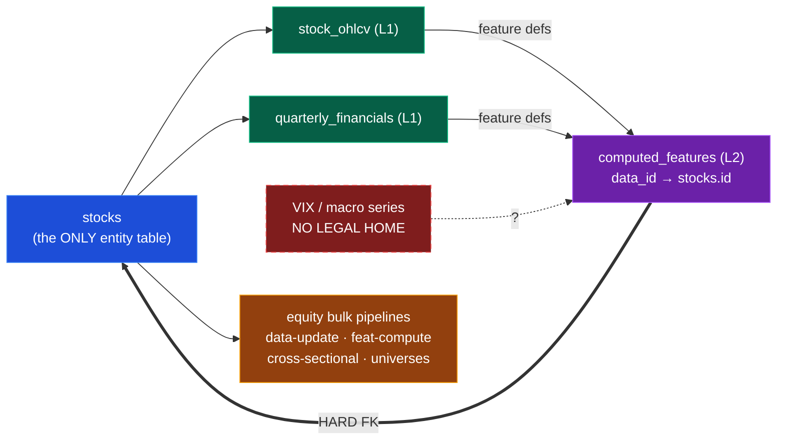
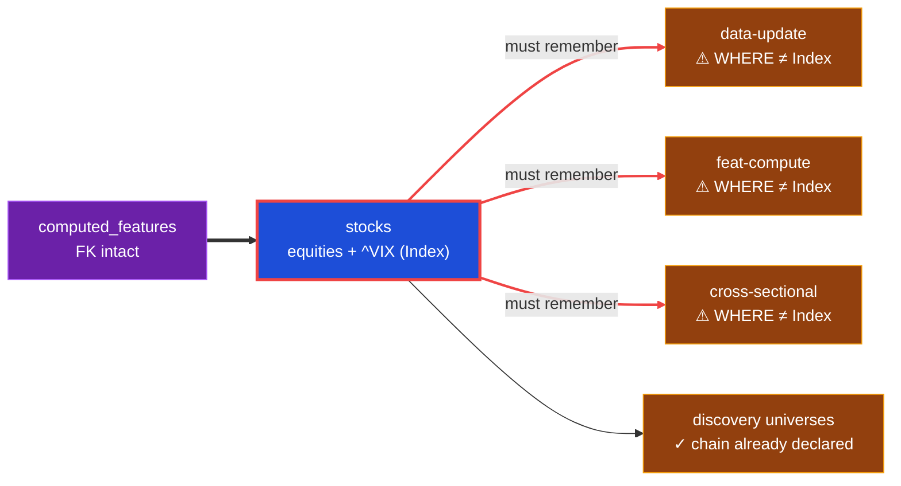
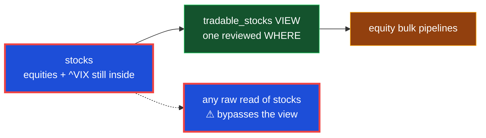
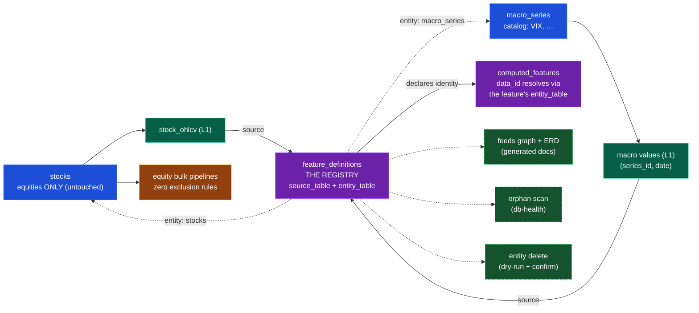

# Design Options: Where Does a Non-Stock Series Live?

Visual record of the 2026-07-08 design review (interactive HTML original explored
during review; preserved here as Mermaid so it renders on the code host and stays
versioned with the spec). Solid arrows are database-enforced or direct reads;
**dashed arrows are declared/logical relationships**; red-flagged nodes and edges
are places someone must *remember* a rule.

## The problem — the entity model is hard-wired

Every feature value's owner is resolved through a hard FK into `stocks`. VIX has no
legal home, and discovery's diagnostics ledger records `macro.vix` as an
uncomputable proposal on every production run.

## Option A — pseudo-symbol (rejected)

`^VIX` masquerades as a stock. The FK survives, but every pipeline must remember an
exclusion clause — forever, including pipelines not yet written. A forgotten clause
fails *silently* (API burn, polluted cross-sectional medians, a tradable index).
This week's two production bugs had exactly this failure shape.

**Verdict: rejected.** Costs compound (N clauses × future pipelines) and the macro
family's arrival would force migrating `^VIX` *out* — production data surgery.
Acceptable only if VIX were a provable one-off.

## Option B — view chokepoint (rejected by owner)

A `tradable_stocks` view centralizes the exclusion in one reviewed place. Better —
but `^VIX` still lives in an equities table, raw reads can bypass the view, and
every future entity kind renegotiates the same predicate. Treats the symptom.

**Verdict: rejected by owner** — "fix the entity model, not the leak."

## Option C — declared entity model (CHOSEN: this spec)

The registry (`feature_definitions`) declares, per feature, both what a computation
*reads* (`source_table`) and who the value *belongs to* (`entity_table`). The hard
FK is retired; the logical key is `(entity_table, data_id)`. Non-equities never
enter equity pipelines because they never enter `stocks` — safety by construction,
zero vigilance. The registry becomes load-bearing for identity, the feeds graph,
and first-class deletion; integrity moves from impossible to *loudly detectable*
(db-health orphan scan, shipped in the same increment).

**Verdict: chosen.** Costs priced and accepted (integrity impossible→detectable;
cascade→registry-driven delete, wanted anyway per the first-class-deletion
principle), conditional on the macro family being real — which the principles
catalog, the unused CPI parser, and the diagnostics ledger all attest.

## Row vs. table: when does a new entity kind earn its own table?

A **row** is a new *instance*; a **table** is a new *kind* — and kind is defined by
structure, not subject matter. Any one of these tips into a new table:

1. **Attribute test** — the entity can't be fully described by the catalog's
   columns (name, provider, kind, cadence). Sectors need constituent membership;
   portfolios need holdings; currency pairs need base/quote legs. Relationships to
   other tables ⇒ new table.
2. **Peer-group test** (the sharpest) — is aggregating/ranking *across* entities of
   this kind meaningful? Across macro series: nonsense (median of {VIX, CPI, 10y
   yield} is not a number) — mutually incomparable singletons stay rows. Across
   sectors: meaningful ("median sector dispersion") — comparable populations get a
   table, because the aggregation boundary (FR-208: within-table allowed,
   cross-table prohibited) should sit exactly where comparability ends.
3. **Consumer-branching smell** — if consumers must branch on the catalog's `kind`
   field beyond provenance/cadence, the kind is trying to be a table. `kind` is a
   label, not a schema.
4. **Cost asymmetry as forcing function** — a row is configuration (SC-207:
   catalog row + ingest config + feature definition, zero DDL); a table is
   owner-approved DDL with layer, prefix, feeds, and deletion story (FR-210). When
   in doubt, start as a row and promote later; rule of three applies.

One-line litmus: *another named, mutually-incomparable market-level series → a
`macro_series` row; own attributes, relationships, or a meaningful peer group → a
new entity table.*
